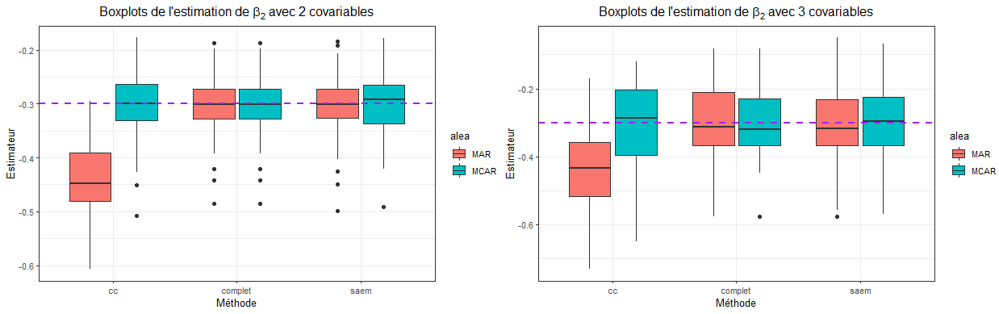
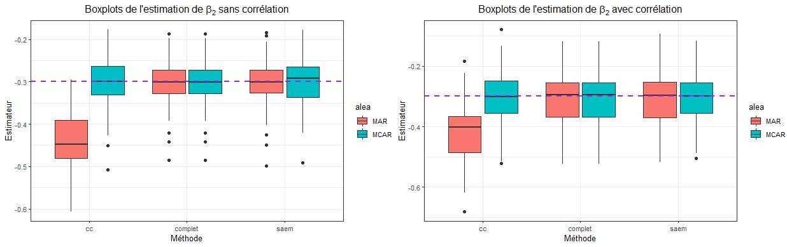
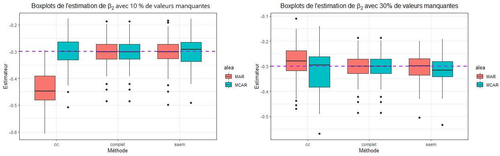

 

```{r setup, include=FALSE}
knitr::opts_chunk$set(echo = FALSE)
```

## Sommaire

- Présentation de l'article
- Simulation d'un jeu de données
- Simulations
- Avantages et limites

# Présentation de l'article

## Article

*Logistic regression with missing covariates—Parameter estimation, model selection and prediction within a joint-modeling framework* 
par Wei Jiang .al en collaboration avec le groupe TraumaBase de l'APHP. 2019

code de l'article :https://github.com/wjiang94/miSAEM_logReg 

package: misaem https://github.com/wjiang94/misaem

Un exemple de classification supervisée avec valeurs manquantes

## Contexte


- Détecter les chocs hémorragiques pour les patients souffrant de traumatismes physiques
- Afin d'apporter une réponse adaptée selon un principe de "red flag"
- Se servir d'une classification supervisée ici la régression logistique
- Prendre en compte les valeurs manquantes omniprésentes dans ce contexte


## Régression logistique

On utilise ce modèle dans le cas d'une réponse binaire. Donc on a une variable réponse $y$ qui suit une loi Bernoulli de paramètre :
$$
p=\frac1{1+\exp(-X\beta)}
$$
On suppose que les covariables suivent une normale $X_i \sim \mathcal N(\mu_i,\Sigma_i)$. On note $\theta =(\mu, \Sigma, \beta)$. 
  
Pour estimer $\theta$ on souhaite utiliser l'estimateur du maximum de vraisemblance.  
  
On introduit des valeurs manquantes à ce modèle selon deux patterns que l'on explicitera .

## Algorithme EM

• étape-E : Evalue la quantité  
$$
\begin{align}
Q_k(\theta) &= \mathbb E[LL(\theta; x, y)|x_{obs}, y; \theta_{k−1}]\\
&=\int LL(\theta; x, y)p(x_{mis}|x_{obs}, y; \theta_{k−1})dx_{mis}.
\end{align}
$$
  
• étape-M : Met à jour l'estimation de 
$$\theta: \theta_k = arg\max_\theta Q_k(\theta)$$.  
  
En pratique, on ne peut pas calculer l'intégrale, même avec un algorithme de MCEM.

## Algorithme SAEM

• Simulation :  Pour $i = 1, 2, . . . , n$, on tire $x^k_{i,mis}$ de
$$p(x_{i,mis}|x_{i,obs}, y_i; \theta_{k−1}).$$

• Approximation stochastique : Met à jour la fonction $Q$ selon  
$$Q_k(\theta) = Q_{k−1}(\theta) + \gamma_k (LL(\theta; x_{obs}, x^k_{mis}, y) − Q_{k−1}(\theta))$$,
où $(\gamma_k)$ est une suite de nombres positifs non-croissante.

• Maximisation : Met à jour l'estimation de $\theta$:
$$\theta_k = arg \max_\theta Q_k(\theta)$$ 
  
On utilise un algorithme de Métropolis-Hasting afin d'estimer l'intégrale.

# Simulation d'un jeu de donnée

## Simulation des covariables

On souhaite simuler des variables gaussienne centrées réduites auxquelles on va rajouter un paramètre de variance et de moyenne.

$$
X_{cr} \sim \mathcal N (0,1)\\
X = X_{cr}\times {\Sigma^*}^\frac12+ \mathbb I_n \mu^*
$$
où $\Sigma^\frac12$ est la décomposition de Cholesky et le paramètre de variance et $\mu$ est le paramètre de moyenne


## Simulation variable réponse

Maintenant qu'on a les covariables du jeu de données on peut simuler la variable réponse $y$. Pour cela on doit une Bernouilli de paramètre $p$, où $p$ est la probabilité d'une inverse logit.

$$
p=\frac1{1+\exp(-X\beta)}
$$

# MCAR vs MAR

## MCAR
**Missing Completly At Random**
  
On note $\eta_i$ la variable indiquant la présence de la donnée ou non.
$$
\eta_{i,j} =
\begin{cases}
1 \text{ si la valeur est présente} \\
0 \text{ sinon}
\end{cases}
$$

On choisit le pourcentage de valeurs manquantes en évaluant $\mathbb P(\eta_{i,j}=0)$ qu'on notera p.miss. 

$$
\eta \sim \mathcal B(p.miss)
$$


## MAR
**Missing At Random**
  

On note $\hat X_i$ toutes les covariables ne possédant pas de valeur manquante. Alors pour simuler les valeurs manquantes on évalue la probabilité d'une inverse logit. 

$$
\mathbb P(\eta_i=0|y,\hat X) = \frac1{1+\exp(\gamma_0 y+ \sum \gamma_i \hat X_i)}
$$
Les $\gamma_i$ sont à calibrer avec le pourcentage de valeurs manquantes désirées (Monte Carlo).

Les valeurs manquantes dépendent des autres covariables.

# Simulations

## méthodes

On utilise dans nos simulations les méthodes **CompleteCase, saem,** comparés au modèle **complet**.

Le modèle **complet**:  opérer une régression logistique avec aucune valeur manquante 

La méthode **Completecase**: éliminer les lignes avec valeurs manquantes

La méthode **saem**: ici introduite.

## 2 covariables et 3 covariables

```{r echo=FALSE, out.width='100%%',fig.align= "center", fig.cap=" Comparaison de l'influence du nombre de covariables sur l'estimation de beta2 sans corrélation avec un échantillon de 500 individus et 10% de valeurs manquantes",include =T}

```

## Corrélation : avec et sans

```{r echo=FALSE, out.width='100%%',fig.align= "center", fig.cap=" Comparaison de l'influence d la corrélation sur l'estimation de beta2 avec 2 covariables sur un échantillon de 500 individus et 10% de valeurs manquantes",include =T}

```

## 10 % et 30 % de valeurs manquantes

```{r echo=FALSE, out.width='100%%',fig.align= "center", fig.cap=" Comparaison de l'influence du pourcentage de valeurs manquantes sur l'estimation de beta2 sur un échantillon de 500 individus avec 2 covariables  et sans corrélation",include =T}

```

## Avantages et Limites

**Avantages :**  
  
- Article bien présenté
- Code disponible sur github : https://github.com/wjiang94/miSAEM_logReg   
   
**Limites :**  
  
- Code n'est pas à jour
- Code beaucoup trop long à faire tourner
- Jeu de données indisponible

